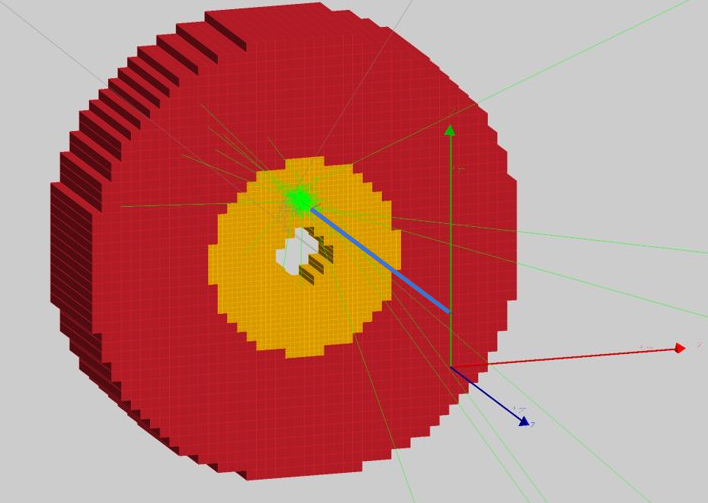

# eic_ai_pid
Apply AI to improve EIC PID

# Materials

### Software

- uproot4. [documentation](https://uproot.readthedocs.io/en/latest/basic.html) [GitHub](https://github.com/scikit-hep/uproot4)
- [awkward arrays](https://awkward-array.org/quickstart.html)
- [hist](https://hist.readthedocs.io/en/latest/)

### Official!

- [EIC White paper](https://arxiv.org/abs/1212.1701)
- [PID detectors](http://www-eng.lbl.gov/~shuman/NEXT/REFs/NIM_A_det_tech_10_particleID.pdf)
- [AI in Hight energy and nuclear physics](https://arxiv.org/abs/1807.02876)
- [AI white paper](https://ec.europa.eu/info/sites/default/files/commission-white-paper-artificial-intelligence-feb2020_en.pdf)

### Easy to grasp

- [EIC](https://www.youtube.com/watch?v=iIE84hrLkBQ)
- [PID Cherenkov detectors](https://www.youtube.com/watch?v=Yjx0BSXa0Ks)
- [Machine learning Andrew NG](https://www.youtube.com/watch?v=PPLop4L2eGk&list=PLLssT5z_DsK-h9vYZkQkYNWcItqhlRJLN)
- [AI simple explanation](https://www.youtube.com/watch?v=aircAruvnKk&list=PLZHQObOWTQDNU6R1_67000Dx_ZCJB-3pi)

## Presentations
- [HENP Data processing](https://1drv.ms/p/s!AmlWQCPqZq7Yg_ATTU6qGJDTMwodGQ?e=YDARnt)
- [GIT](https://git-scm.com/book/en/v2)

## Calendar

- November 1st - Introduction to python uproot, data processing
- November 8  - Try to process some real data from our experiment
- November 15 - Prepare data to some AI
- November 22
- November 29

We should have: 

1 - AI result
2 - training data
3 - data simulation preparation
4 - know how to prepare/process data

## Particle gun paramters

- Particle gun, 1 particle per event​
- Perpendicular to calorimeter​
- Pointing close to a cell center ​
- 10k events for each
- pi- and e-
- Naïve reconstruction (sum of all cells)

